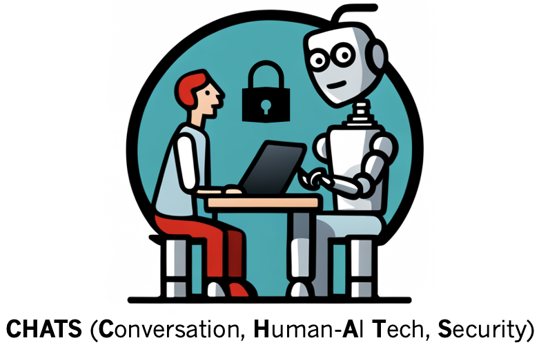

CHATS (**C**onversation, **H**uman-**A**I **T**echnology, **S**ecurity) Lab

<!--  -->

**Future directions:**
<ul>
  <li>Expert Interactive AI Systems, e.g., AI doctor, AI coach, AI lawyer, etc</li>
  <li>Privacy-preserving AI technology</li>
  <li>Multi-modal Multi-party Conversational Agent</li>
  <li>Computational Social Science/Human-Computer Interaction</li>
</ul>

I am joining Northeastern University in Fall 2024. If you are interested in working with me, feel free to fill out [this form (PhD/intern)](https://forms.gle/WNUv7y8ds4dXoVkH8) or [this form (Postdoc)](https://forms.gle/AwWxjcEsCD9LdswFA) and send me an email :)